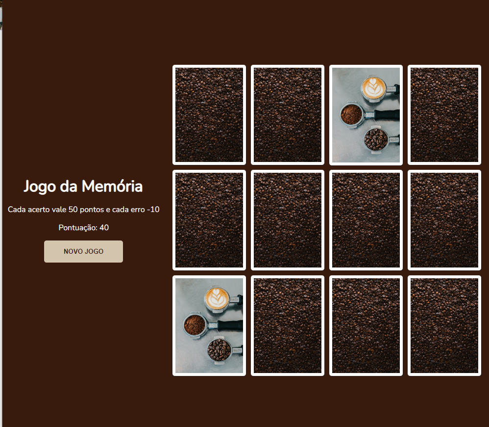

<h1 align='center'>Jogo da memória: Mundo café</h1>

****

## Descrição

Desenvolvimento de um jogo da memória utilizando apenas HTML, CSS e Javascript. Trabalhando efeitos 3D no CSS e lógica de programação utilizando condicionais, Immediately Invoked Function Expression e manipulação de Array.

## Projeto

